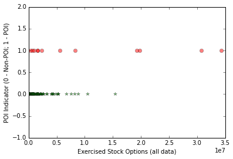
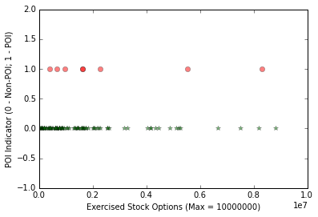

## Enron POI Identifier Project / Intro to Machine Learning

**Jie Cao**

### 1. Introduction
The Enron scandal in early 2000 led to one of the largest corporate fraud cases in American history ([see here](http://en.wikipedia.org/wiki/Enron_scandal)). In this project, using email and financial data for 145 executives at Enron, I applied machine learning techniques to identify persons of interest in the Enron case. A person of interest (POI) is defined as someone who was indicated for fraud, settled with the government, or testified in exchange for immunity. This report documents the processes of building the POI identifier.

### 2. The Enron Data
The Enron data set for this analysis is provided by Udacity and is assembled using raw data from three sources:  [the POI data](http://usatoday30.usatoday.com/money/industries/energy/2005-12-28-enron-participants_x.htm), [the email data](http://www.cs.cmu.edu/~./enron/), and [the financial data](http://fl1.findlaw.com/news.findlaw.com/hdocs/docs/enron/enron61702insiderpay.pdf). Thanks, Udacity!

#### 2.1 Variables in the data set
The data set contains three major types of variables.

* financial features: ['salary', 'deferral_payments', 'total_payments', 'loan_advances', 'bonus', 'restricted_stock_deferred', 'deferred_income', 'total_stock_value', 'expenses', 'exercised_stock_options', 'other', 'long_term_incentive', 'restricted_stock', 'director_fees']  (all units are in US dollars)

* email features: ['to_messages', 'email_address', 'from_poi_to_this_person', 'from_messages', 'from_this_person_to_poi', 'poi', 'shared_receipt_with_poi'] (units are generally number of emails messages; notable exception is ‘email_address’, which is a text string)

* POI label: [‘poi’] (boolean, represented as integer)

#### 2.2 Errors in the financial data

While processing the data, I found that financial data for 'BELFER ROBERT' are full of errors. I manually corrected them. These errors were found after I constructed a new feature, 'fraction_exercised_stock'. When I plotted it, an obvious error showed up on the plot, a negative value for 'fraction_exercised_stock'. After I investigated the data further, I found the errors are from the data point 'BELFER ROBERT' and it also contains more errors. (See section 3 for the new feature; the plot is omitted in this report.)

#### 2.3 Outlier
The original data set contains an outlier (found in the mini-project 7), which corresponds to a summary line in the financial data spreadsheet. The outlier was removed at the beginning of the analysis. No other outliers were found in the data set.

After removing the outlier, there are in total 145 executives in the data, and among them 18 are POIs.

### 3. Feature Processing
I created 4 new features that may potentially be useful for identifying the POIs.

* 'fraction_from_poi': emails from poi to this person as a fraction of total emails to this person
* 'fraction_to_poi': emails from this person to poi as a fraction of total emails from this person
* 'fraction_shared_receipt_with_poi': emails shared receipt with poi as a fraction of total emails to this person
* 'fraction_exercised_stock': exercised stock options as a fraction of total stock value

The idea behind the first 3 new features is that those who have large proportions of emails to/from/shared-receipt-with known POIs may be POIs themselves as they may collude through emails. The idea behind the last new feature is also intuitive. One would expect POIs were insiders that knew what's going on and when things went wrong they should be the ones to first exercise their stock options to cash out ahead of the crash of the Enron stock.

### 4. Feature Selection, Algorithm Selection and Tuning

I used two approaches to select features to be fed to the classifier: (1) intuition and trial and error; and (2) feature selection algorithm, in particular, SelectKBest(). For selecting classifiers, I tried many classifiers and compared their performances. The classifiers I tried are Naive Bayes, Support Vector Classifier, Decision Tree,  Random Forest and Ada Boost.

In this report, I present two final algorithms that both meet the required performance. One uses intuition, trial and error to select the features and uses Decision Tree as the classifier. The other uses SelectKBest() to select features and Naive Bayes as the classifier. The first algorithm is the preferred one. The reason to present the second algorithm is discussed below. I will also briefly discuss why other classifiers I tried are not chosen as preferred algorithms.

#### 4.1 Trial and error feature selection & Decision Tree classifier 

It's impossible to manually try every combinations of even a small set of features. Therefore, first, I used some intuitions and the graphs we did during the mini-projects to identify a few potentially important features. They are 'salary', 'total_payments', 'total_stock_value', 'exercised_stock_options', 'fraction_exercised_stock', 'fraction_from_poi', and 'fraction_to_poi'. Second, I tried some combinations of 1, 2 or all of them with a few classifiers mentioned above. Last I chose the algorithm with the best performance. 

I found that the feature 'exercised_stock_options' together with the Decision Tree classifier delivers good performance. The intuition behind the 'exercised_stock_options' is similar to the one of 'fraction_exercised_stock' as already discussed in the previous section: POIs were insiders that knew what went wrong so they may cash out before stock market crash. Therefore, One would expect 'exercised_stock_options' to contain useful "information".

As I will discuss in section 4.3, combining 'exercised_stock_options' with 'fraction_exercised_stock' or using 'fraction_exercised_stock' alone with Decision Tree also deliver quite good performance. My final preferred feature set contains the single feature 'exercised_stock_options' for reasons to be discussed.

I tuned the parameter min_samples_split for the Decision Tree classifier, I chose the parameter to be 80 which gives the best performance among parameters tried. I will interpret the evaluation measures under this parameter value in the next section. For now, simply notice the tradeoff between precision and recall, although the change of recall is tiny especially when min_samples_split is less than 80.

Table 1. Tuning the parameter `min_samples_split` in DecisionTreeClassifier().

`min_samples_split` | average precision  | average recall | average F1
:-------------: | :-------------: | :-------------: | :---:
10  | 0.65415	| 0.57500 | 0.61203
30  | 0.78347	| 0.57350 | 0.66224
50  | 0.84900	| 0.57350 | 0.68457    
70  | 0.87557	| 0.57350 | 0.69305    
**80**	| **0.87893**	| **0.57350** | **0.69410**
90	| 0.89704	| 0.44000 | 0.59041 
95	| 0.98997	| 0.34550 | 0.51223    
100 | * | * | *

\* when `min_samples_split = 100`, I got exception error "Got a divide by zero when trying out: ..."

Since when `min_samples_split = 80`, the precision and recall are relatively high, and in addition the F1 score is also the highest, which implies a high "average" of precision and recall and a good balance of the two, this (80) is the choice of the value to set for the parameter. (Note that the precision or the recall when `min_samples_split = 80` are not the highest among all parameter tried.)

The performance seems a bit too good, so I was cautious about any potential bugs. I did three things to double check the results.

1. I checked the number of data points and POIs after the feature selection. There are 106 data points after feature selection and 18 POIs. The loss of data points is due to the fact that some executives don't have the data for 'exercised_stock_options' (NaN). The good news is that all the POIs remains.

2. I plotted the feature 'exercised_stock_options' to see if there is anything abnormal (see below). I didn't see anything wrong.  

3. I also plotted the graph for decision tree (The graph is not shown here. I trained algorithm using the full data set for the plot. It was a first pass check), and I didn't see anything wrong. 

#### 4.2 SelectKBest() & Naive Bayes classifier 
In the Udacity sample report, Naive Bayes classifier is abandoned due to its biased prediction. I choose to report my result on Naive Bayes classifier to show that it works just fine and it meets the requirement if combining with SelectKBest(). The performance of this algorithm is not as good as the previous one, so it's not my preferred final algorithm.

SelectKBest() is used to selected the features and Naive Bayes classifier is used as the classifier. I "pipelined" the two steps, and both SelectKBest() and Naive Bayes are parts of the algorithm to be evaluated. Hence the chained two steps are both trained over the training set. Note that it is a good practice to apply the selection algorithm over the training set. Otherwise the evaluation may be biased ([see here](http://nbviewer.ipython.org/github/jming/cs109/blob/master/lec_10_cross_val.ipynb)).

The parameter to tune here is the number of features to selection, k. The result of tuning is presented in the table below. The preferred k is 5. The choice is obvious as it gives the highest precision, recall and F1.

Table 2. Tuning the parameter `k` in SelectKBest()

`k` | average precision  | average recall | average F1
:-------------: | :-------------: | :-------------: | :---:
3  | 0.31186	| 0.22750 | 0.26308    
4  | 0.37095	| 0.28600 | 0.32298    
**5**	| **0.42036**	| **0.33650** | **0.37379**
6	| 0.38557	| 0.31000 | 0.34368 
7	| 0.38025	| 0.30800 | 0.34033  

Since the feature selection algorithm is applied to the training set, features chosen depend on the training and testing set split. Hence, here I present the ranked frequency count of features chosen as a fraction of total number of validation iterations (under the chosen parameter `k=5`).

    Total number of validations:  1000.0
    
    Frequency count for features selected (fraction of totoal # of validation)
    --------------------------------------------------------------------------
    poi : 1.0
    total_stock_value : 0.988
    bonus : 0.971
    exercised_stock_options : 0.97
    salary : 0.883
    fraction_to_poi : 0.774
    deferred_income : 0.232
    long_term_incentive : 0.073
    restricted_stock : 0.057
    fraction_shared_receipt_with_poi : 0.038
    shared_receipt_with_poi : 0.01
    from_poi_to_this_person : 0.002
    expenses : 0.002
    -------------------------------------
    
I comment three points for the frequency count.

1. The 'poi' is the label.
2. Financial features are chosen most of the time and email related features are not chosen often by the algorithm.
3. Frequency count may not reflect the importance of the features selected.

#### 4.3 Other features & classifiers

I this section, I briefly discuss a few other features and classifiers I tried, and why I didn't choose them as the final preferred algorithms.

As mentioned in section 4.1, combining 'exercised_stock_options' with 'fraction_exercised_stock' or using 'fraction_exercised_stock' alone with Decision Tree also deliver quite good performance. For example, using 'fraction_exercised_stock' alone and Decision Tree with parameter `min_samples_split = 80`, I obtained an average precision of 1.00000 and an average recall of 0.32600. Thus, this is a very conservative algorithm that is rarely wrong when it flags a POI, but quite often misses flagging true POIs. However, the main criteria I use to choose my preferred algorithm is not just precision or recall. It is both of them and their overall "average" as reflected in the F1 score, which takes into account of both precision and recall to indicate how the algorithm is reliable and accurate. In this case, the F1 score is only 0.49170, lower than the preferred case in section 4.1.

Combining 'exercised_stock_options' with 'fraction_exercised_stock' and using Decision Tree gives only sightly worse (very close) performance than the preferred one. Using Random Forrest with the above two features combined or alone also deliver very similar performance. I chose my preferred algorithm for its slightly better performance and its simplicity

When using the feature selection algorithm (approach 2), I also tried varies classifiers, they don't seem to deliver as good performance as my preferred one. Hence they are not chosen.

### 5. Analysis Validation and Performance
Because of the small size of the data set, the algorithm is validated using stratified shuffle split cross validation. The number of iterations/folds is 1000.

In this section, I interpret the result of 'exercised_stock_options' and Decision Tree algorithm (`min_samples_split = 80`). (See section 4.1 and table 1). Discussion on  result of SelectKBest() and Naive Bayes is similar, and hence omitted.

First I reproduce the evaluation scores in the following table (adding also a few other measurements).

Table 3. Evaluation scores; feature: 'exercised_stock_options'; classifier: Decision Tree; Parameter: `min_samples_split = 80`

measurement   | average value  |
:-------: | :------------: | 
precision  | 0.87893
recall  | 0.57350
F1	| 0.69410
F2	| 0.61634
  |  
total predictions | 11000
true positives | 1147
false positives|  158
false negatives|  853
true negatives | 8842
  

When taking `min_samples_split = 80`, the algorithm achieves a precision of 0.89893 and a recall of 0.57350. They are both quite good. Precision measures the probability of a person being a true POI given the person is flagged as a POI by the algorithm. My near 0.9 precision score means that whenever a person gets flagged as a POI in the test set, I am very confident that the person is likely a real POI and the flag is not a false alarm.

Recall measures the probability that a person will be flagged as a POI given the person is a true POI. My recall of 0.57 means whenever a POI shows up in my test set, with above half chance the algorithm will identify the person.

F1 score takes into account both precision and recall. (It takes the harmonic mean of recall and precision `F1 = 2 * (recall * precision) / (recall + precision)`) It means both the false positive rate and false negative rate are not too high, and the algorithm has an overall good performance.

F2 score is similar to F1, but weights recall higher than precision. Hence my F2 score is a bit lower than F1 but not too bad.

There is usually a tradeoff between precision and recall. When choosing an algorithm, I aim for high precision and recall as well as balance (i.e. the F1 score). An extreme conservative or trigger-happy algorithm is not what I aim for.

### 6. Discussion, Conclusion & Reflection
In this report, I documented the process of building a POI identifier for the Enron case. The preferred algorithm only uses one feature and a simple Decision Tree classifier. However, it achieves a reasonable good performance.

There are certain steps of the process I can do better. First, although I found some errors in the data set and corrected them, I didn't thoroughly audit the data. The data may contain more errors. Second, while I chose the Decision Tree classifier as the preferred algorithm, I only tuned one of its parameters. Tuning more parameters using GridCV() may help bring up the performance. 

In addition, looking at the fundamentals, there are more I can do to potentially obtain a better algorithm. First, as pointed out in the sample report. There were 35 POIs identified in the "real life", but only 18 of them are in the data set. Finding data for the other POIs and add them to the current data set sure will improve the accuracy of the algorithm.

Second, as also pointed out in the sample report, there is a big email data set available. While we used some information in the email data set, it didn't really play a big role in the final algorithm chosen. Potential, the text data of the email may contain important information. Natural Language Processing and Principal Component Analysis could be applied to the email text message to see if we can find more "information" for the identification algorithm.

Personally I learned a lot from this project as well as the intro course itself. I like the course's balance between the theory, intuition and application. Since it is an intro course, I am very happy to see it leans towards intuition and hands-on practices. I can always look up the detailed theory if I want to, but to get started, gaining good intuitions and doing projects are the way to go. As I enjoyed the project so much, I found myself spend a bit too much time on it during the day time while I was supposed to do something else. While the course gets me interested in Machine Learning, I sure know that what I've seen so far is just the tip of the iceberg. I will continue to learn this subject and to discover its potential applications on my own work.
